# Last Chaos GM Tool

A modern Game Master administration panel for Last Chaos private servers.

Built with Electron + Vue 3 to provide a fast, lightweight and user-friendly interface for server administration, event management.

---


## Main Features

### Announcement Center

Create and send server-wide announcements in seconds.

Features:
* Event start announcements
* Maintenance warnings
* Countdown messages
* Custom broadcast messages
* Echo All support
* Dynamic command generation

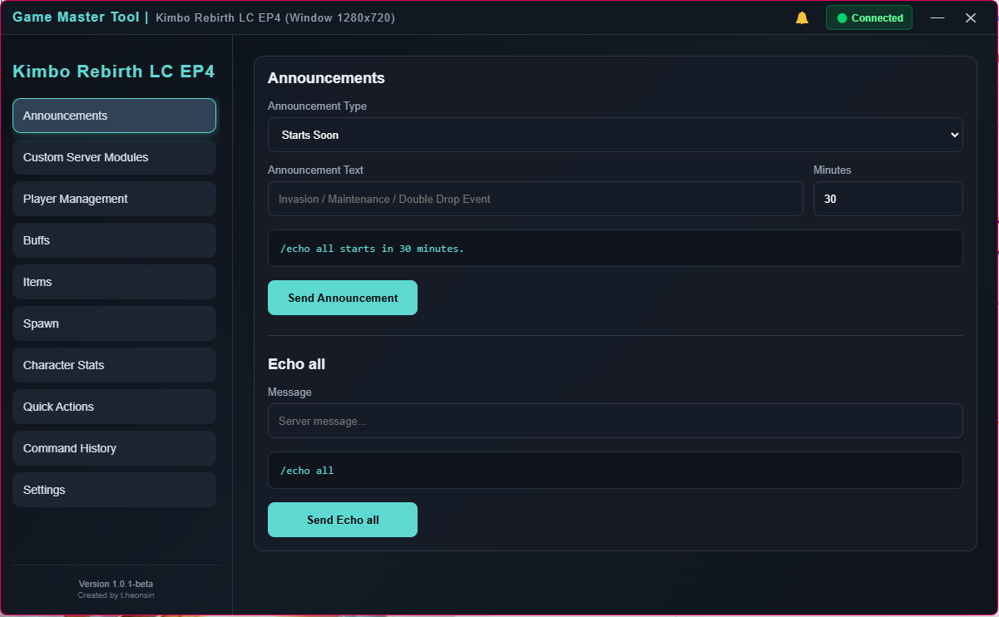

### Event Management
Server-specific event tools and event automation modules.

Supports custom server implementations and expandable event packs.

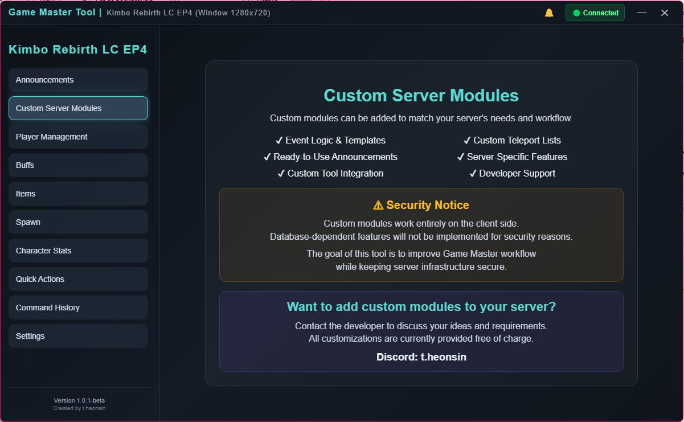

### Player Management
Administrative actions for player moderation.

Available actions:
* Mute Player
* Kick Player
* Ban Player
  
Features:
* Character name input
* Mute duration selection
* Automatic command generation
* One-click execution

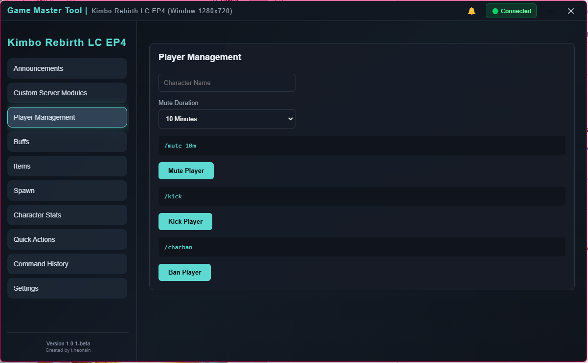

### Buff Management
Quick access to commonly used GM buffs.

Included:
* Blu Cube Effect
* Winds Blessing
* Custom Buff Commands

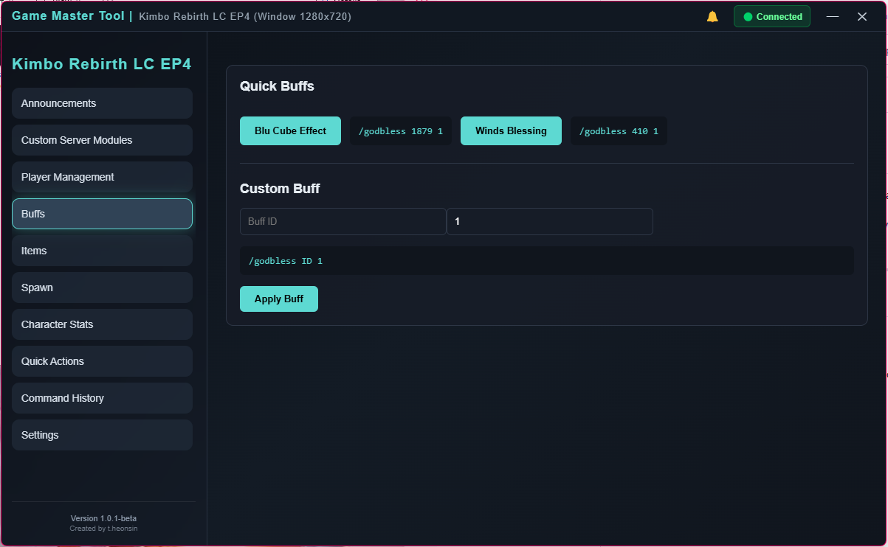

### Item Tools
Integrated item string reader.

Features:
* Automatically loads item names from the selected game client
* No built-in database required
* Supports custom server items
* Search by Item ID
* Search by Item Name
* Fast command generation

Supported files:
  - strItem_us.lod

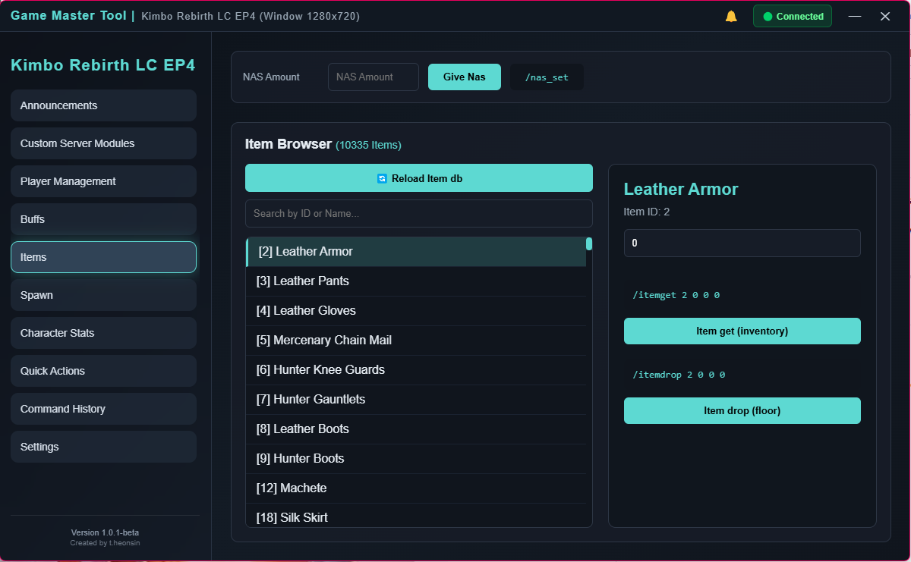

### Spawn Tools
Integrated NPC string reader.

Features:
* Automatically loads NPC names from the selected game client
* No built-in database required
* Supports custom server NPCs
* Search by NPC ID
* Search by NPC Name
* Spawn command generation

Supported files:
- strNpcName_us.lod

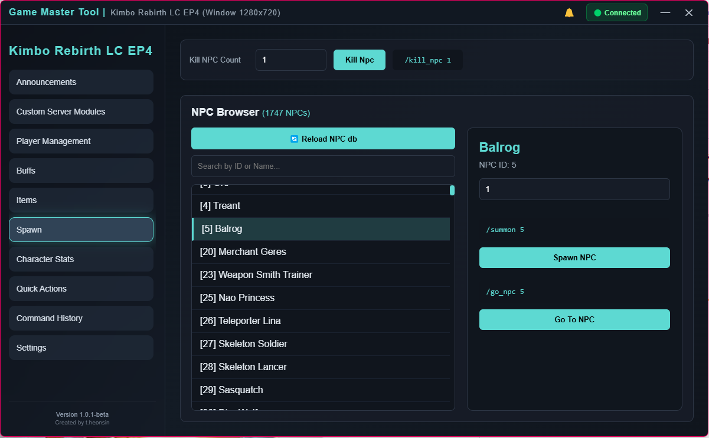

### Character Statistics
Character enhancement utilities.

Included:
* Speed Buff Generator
* Stat Distribution Tool

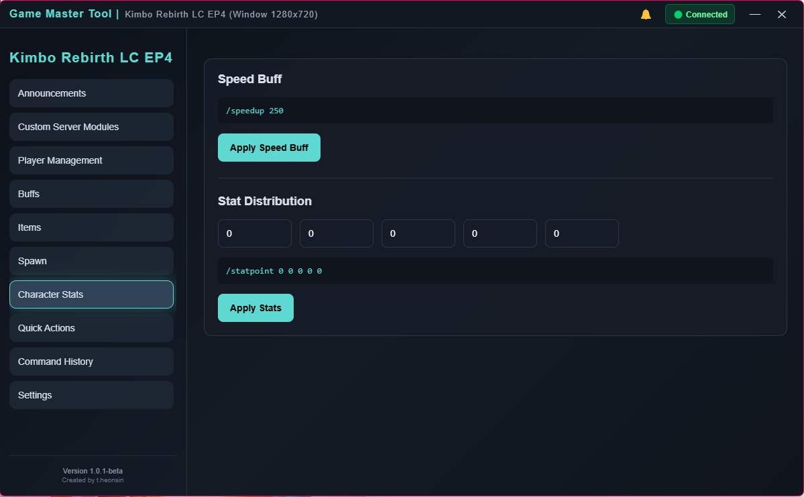

### Quick Actions
One-click Game Master shortcuts.
Available actions:
* Invisible Mode
* Immortal Mode
* Speed Buff
* Teleport To Zone
* Go To Player
* Summon Player

Designed for rapid in-game administration.

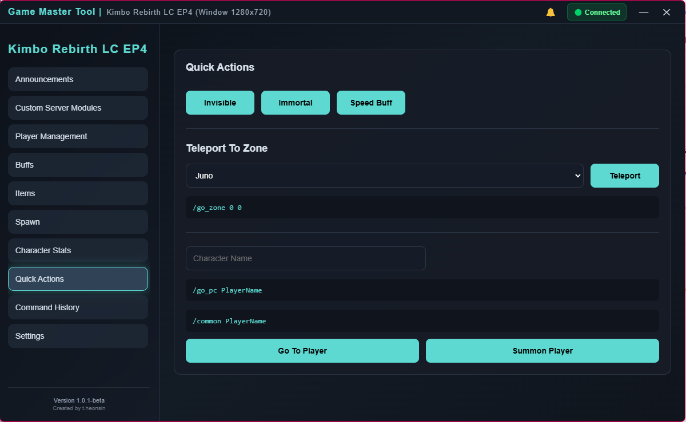

### Command History
Track executed commands.

Features:
* Command logging
* Usage statistics
* Latest command tracking
* History cleanup
  
Useful for administrative auditing and repeated actions.

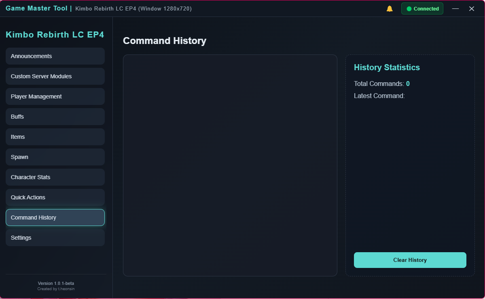

### Automation System
Built-in Auto Command scheduler.

Features:
* Auto Buff #1
* Auto Buff #2
* Custom command support
* Configurable intervals
* Queue protection
* Command delay configuration

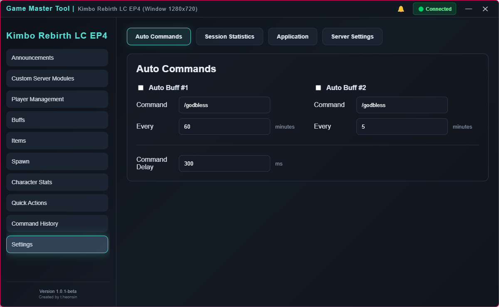

### Session Statistics
Monitor current administration session.

Tracks:
* Commands sent
* Session duration
* Session start time
* Connected client
* Str status

Provides a quick overview of GM activity.

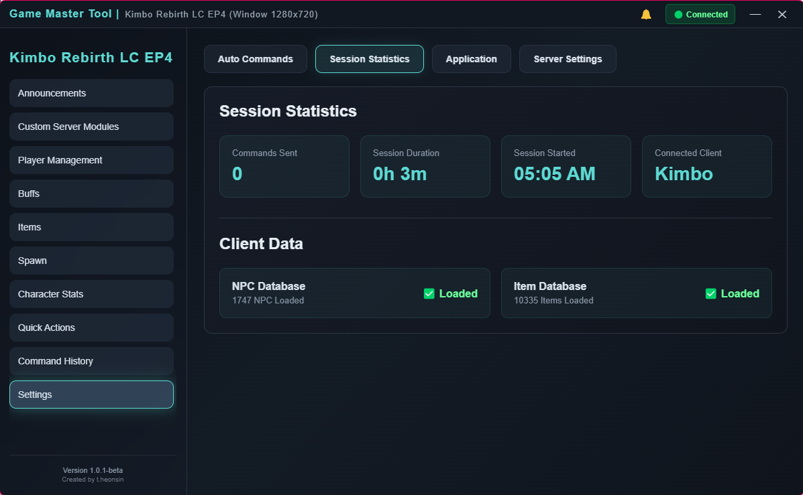

### Application Settings
**Themes**

Built-in themes:
* Ocean
* Crimson
* Emerald
* Violet
  
**Startup Options**
* Remember Last Selected Client
* Update Preferences

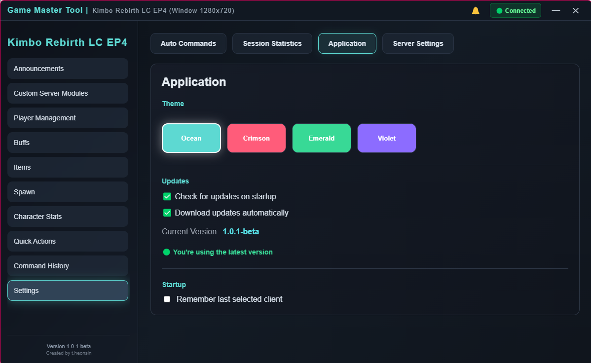

---

## Automatic Updates
Integrated GitHub Release updater.

* Automatic update checks
* Update notifications
* One-click installation
* Automatic application restart
* Version status monitoring

Available statuses:

* 🟢 You're using the latest version
* 🟡 Update available


## Multi-Client Support
The application can detect active Last Chaos clients automatically.

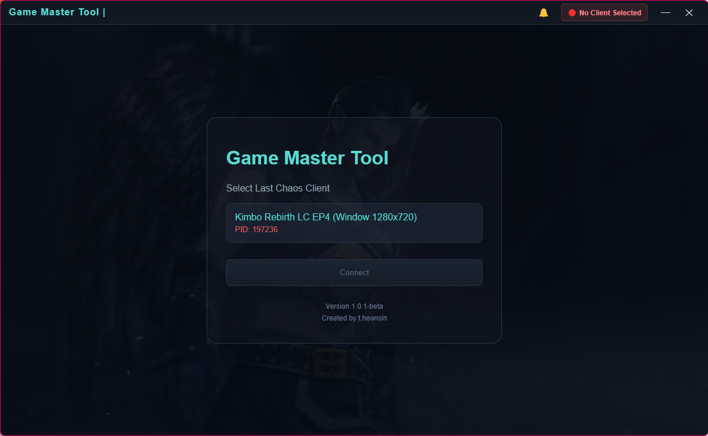

---

## Security

The application automatically detects administrator privileges.

Certain advanced functions require elevated permissions in order to communicate directly with the game client.

Features include:
* Administrator privilege detection
* One-click restart as administrator
* Secure process communication

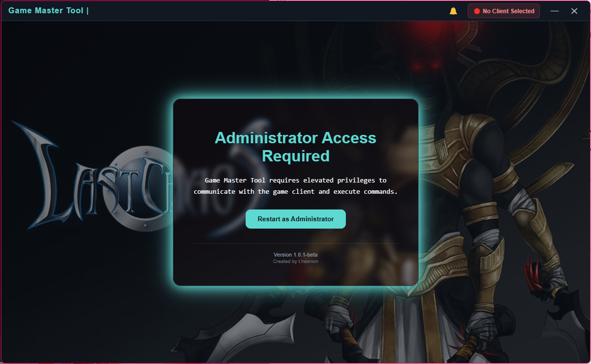

---

## Technology Stack

### Frontend
* Vue 3
* Vite
* Composition API


### Desktop
* Electron

### Native Integration

* RobotJS
* Windows Process APIs
* PowerShell Automation

### Updates
* Electron Updater
* GitHub Releases

---

## Installation

Download the latest release from the Releases section and run:

```bash
Last Chaos GM Tool-Setup-x.x.x.exe
```

The application will install itself and automatically handle future updates.

---

## Project Status

Active Development

New features, quality-of-life improvements and administration tools are continuously being added.

---

Created by **theonsin**

[](https://wakatime.com/badge/user/d552153a-46a4-4e4d-844e-f5cec15b1459/project/37e28444-e1a0-426e-90b3-8e6318907753)
